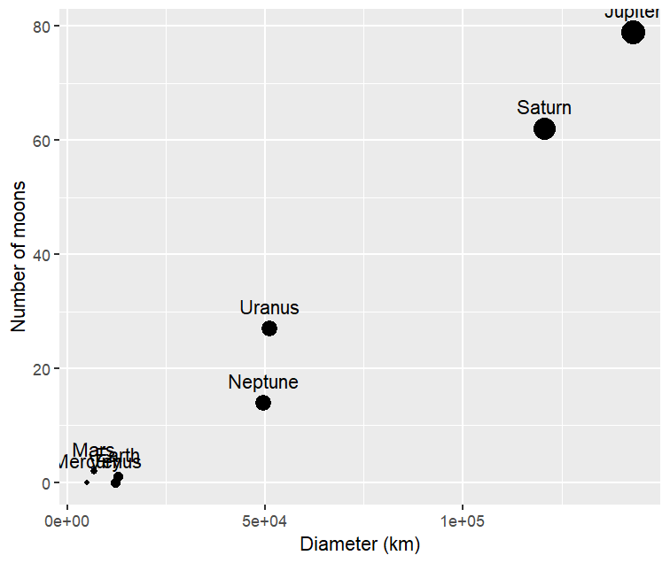

# 📊 Tidy Data Wrangling with `tidyr` in R

## 🌟 Project Overview
This project demonstrates advanced data cleaning and reshaping techniques using the **Tidyverse** ecosystem in R. I transformed "messy" real-world datasets into a "tidy" format suitable for analysis and visualization.

## 🛠️ Key Skills
* **Reshaping Data**: Using `pivot_longer()` and `pivot_wider()` to organize variables.
* **String Manipulation**: Handling complex lists using `separate_rows()`.
* **Visualization**: Creating data-driven insights with `ggplot2`.

## 📈 Featured Insight: Planetary Characteristics
After tidying the planetary dataset, I visualized the relationship between a planet's diameter and its number of moons.

> **Conclusion**: Larger planets, particularly gas giants like Jupiter and Saturn, exhibit a significantly higher number of natural satellites compared to smaller terrestrial planets.

## 📂 Repository Contents
* `tidy-messy-data-using-tidyr-in-r.R`: The complete analysis script.
* `planet_wide.csv`: Astronomical metrics.
* `netflix_data.csv`: Streaming metadata cleaning.
* `nukes.csv`: Historical testing records.

---
## 👤 Contact
**Leelaissakattaota**
📧 [attotaleelaissak@gmail.com](mailto:attotaleelaissak@gmail.com)
